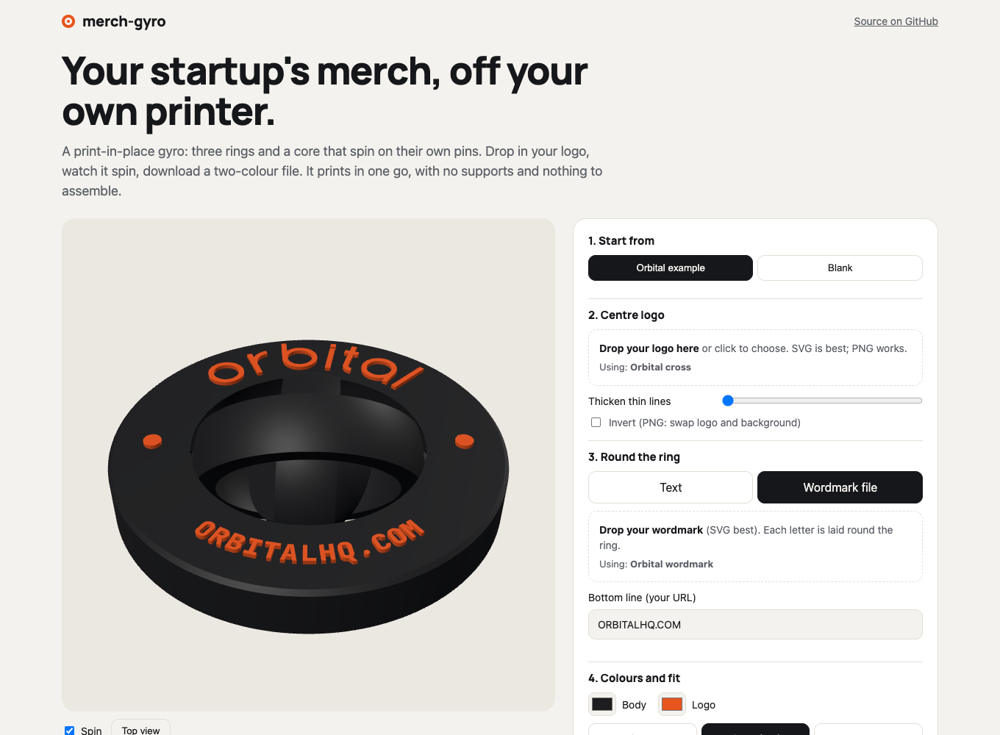

# merch-gyro

Startup merch you can print yourself. This is a print-in-place gyroscope fidget: three rings and a core, each spinning on its own pins. You put your logo on it in the browser and download a two-colour file. It prints in one go, with no supports and nothing to assemble.

**Make yours: [merch.hammantlabs.com](https://merch.hammantlabs.com)**



I built it in my first week as CEO of [Orbital](https://orbitalhq.com), because we needed merch. The Orbital one is in [`examples/orbital/`](examples/orbital): [3MF](examples/orbital/orbital-gyro.3mf) or [STLs](examples/orbital/orbital-gyro-stl.zip).

## Using it

1. Drop your logo into the centre. SVG is best; PNG and JPG are traced.
2. Put text round the ring, or drop in your wordmark. Each letter is laid on the arc without being bent.
3. Add a bottom line (your URL), then pick colours and a fit.
4. Download the 3MF. In Bambu Studio or OrcaSlicer, the body is filament 1 and the logo is filament 2.

Everything runs in your browser. Your logo is never uploaded anywhere.

## Printing

| | |
|---|---|
| Size | 56 mm across, 8.6 mm tall |
| Time | about 30 minutes and 14 g of PLA on a Bambu P1S (9 per plate: about 3 hours) |
| Settings | 0.2 mm layers, no supports, no brim |
| Colour | the logo is the top 3 layers, so a whole plate needs one colour change |
| One-colour printer | print the one-colour STL and add a filament change at 8.2 mm |
| After printing | twist each ring gently to free it |

If the rings fuse on your printer, choose **Loose** (0.6 mm gap). If they rattle, choose **Snug** (0.4 mm).

## How it works

- **Rings:** each ring is a band cut from a spherical shell, so it can turn through its neighbour without touching.
- **Pins:** 45-degree cones, so they print without supports. Each one sits in a cone-shaped socket with 0.35 mm of clearance all round.
- **Axes:** they alternate X, Y, X, which makes it a true gimbal.
- **Artwork:** it's raised 0.6 mm and kept inside a radius where it can never hit the next ring, whatever the logo.

The geometry is built with [manifold](https://github.com/elalish/manifold) (WASM), text with [opentype.js](https://opentype.js.org), and the preview with [three.js](https://threejs.org). There's no build step: `index.html` plus ES modules in `src/`.

- `src/gyro.js`: the geometry, the arc layout and the print-in-place checks (it runs in Node too)
- `src/art.js`: reads your SVG or PNG logo
- `src/text.js`: lays out text for the ring
- `src/export.js`: writes the 3MF and STLs
- `src/preview.js`: the spinning 3D preview

## Tests

```bash
npm install
npm test               # geometry: every fit, every ring, 24 angles
npm run serve          # then, in another terminal:
node tests/e2e.mjs     # drives the real page in Chrome
```

`npm test` checks the guarantees as numbers for each fit:
- Four separate parts.
- No overlap at any angle, including all three rings tumbling at once.
- A 0.2 mm nudge in any direction is still free, so the gaps are real.
- A 1.5 mm push always hits something, so nothing can fall out.

## Licence

The code is MIT. The Orbital name, cross and wordmark are Orbital's trademarks and are included as an example only; see [TRADEMARKS.md](TRADEMARKS.md). The fonts are SIL OFL.
